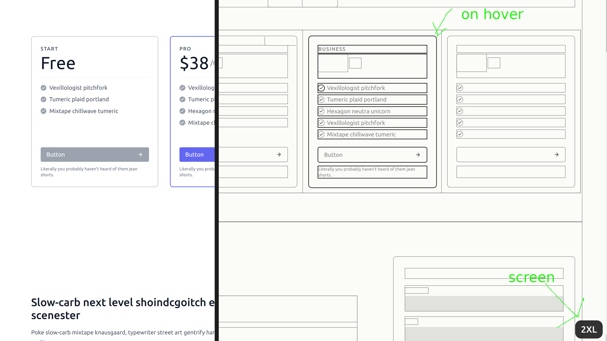

# Tailwind CSS ~ Debug Mode

A plugin that provides a `debug` component that makes it visually easier to view the document structure.

## Preview



## Example

View an example of the debug mode in action: [https://jeroengerits.github.io/tailwind-debug-mode/](https://jeroengerits.github.io/tailwind-debug-mode/)

## Basic usage

```html
<!-- Enable debug mode : -->
<body class="debug">
  <!-- ... -->
</body>
```

> Currently, the plugin only supports the `debug` component on a body element.

## Installation

Install the plugin

```sh
# Using npm
npm install tailwind-debug-mode

# Using Yarn
yarn add tailwind-debug-mode
```

Then add the plugin to your `tailwind.config.js` file:

```js
// tailwind.config.js
module.exports = {
  plugins: [
    require('tailwind-debug-mode'),
    // ...
  ],
}
```

## Configuration

Define your own color scheme

```js
// tailwind.config.js
module.exports = {
  plugins: [
    require('tailwind-debug-mode')({
      wireColor: '#000000cc', // the color of the wires
      svgColor: '#000000cc', // the color of the svg
      textColor: '#33333399', // the color of the text on hover
      inputColor: '#33333322', // the background color of input elements
    }),
    // ...
  ],
}
```
